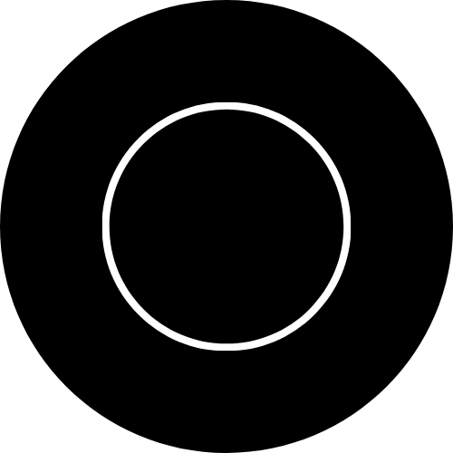

<head>
    <meta charset="UTF-8">
    <meta name="viewport" content="width=device-width, initial-scale=1.0">
    <link rel="stylesheet" href="style.css">
</head>

<body class="front-page">
    
    

        "And hold firmly to the rope of Allah all together, and do not be divided."
    

    

        <button id="english-button">English</button>
        <button id="bahasa-button">Bahasa</button>
    

    

        
        

            
            
Public Domain. Anything in this public domain is freely usable by anyone without obtaining permission and without citing the original author, but no one can ever own this.

        

    
 <!-- Closing div for social-links -->

    <!-- Previous and Next buttons with arrow symbols -->
<button id="prevButton">&#8592; Previous</button>
<button id="nextButton">Next &#8594;</button>

</body>
