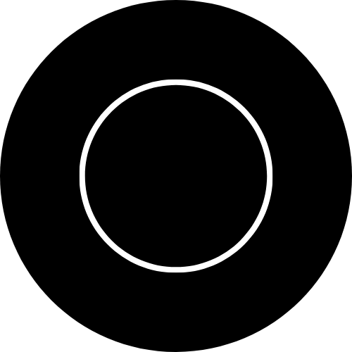

<head>
    <meta charset="UTF-8">
    <meta name="viewport" content="width=device-width, initial-scale=1.0">
    <link rel="stylesheet" href="style.css">
</head>

<body class="front-page">
    
    

        Mohd bin Mohd
    

    

        <button id="bahasa-button">Spektrum</button>
    

    

        
        
        

            
            
Domain Awam. Apa-apa sahaja dalam domain awam ini boleh digunakan dengan bebas oleh sesiapa sahaja tanpa perlu mendapatkan kebenaran dan tanpa perlu memetik pengarang asal, namun tiada sesiapa pun yang boleh memiliki hak ke atasnya. Ilmu bukan untuk dijual.

            
Dioptimumkan untuk telefon dan tablet dalam mod potret.

        

    
 <!-- Closing div for social-links -->

 
</body>
